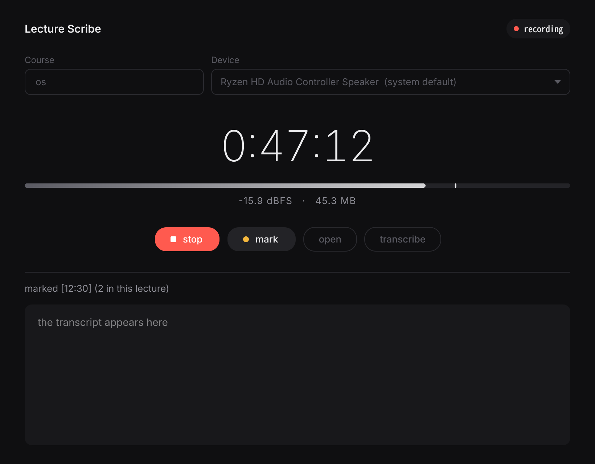
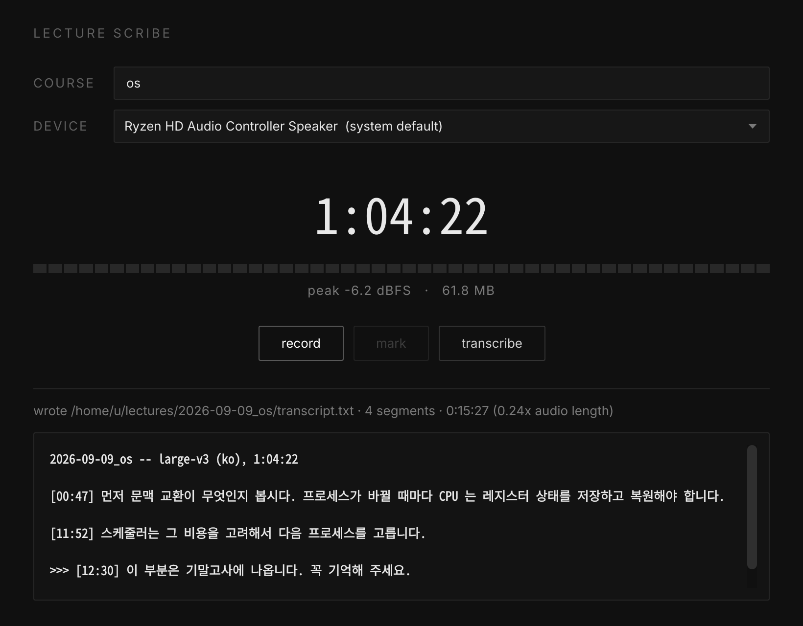

<h1 align="center">
  <picture>
    <source media="(prefers-color-scheme: dark)" srcset="./.github/assets/lecture-scribe-dark.png">
    
  </picture>
</h1>

<p align="center">
  <i align="center">Record the Korean lecture your computer is playing, and read it back as text 🎧</i>
</p>

<h4 align="center">
  <a href="./LICENSE">
    
  </a>
  <a href="./pyproject.toml">
    
  </a>
  <a href="#introduction">
    
  </a>
  <a href="#introduction">
    
  </a>
</h4>

<p align="center">
    
</p>

## Introduction

`lecture-scribe` records what your computer is playing — a Korean lecture in a
browser tab — and turns it into a readable transcript with timecodes.

No microphone, no speakers in the loop, no cloud. The audio never leaves the
machine, and the only network request in the tool's life is downloading the
speech model once.

```
   system audio  ──▶  <name>.wav ──▶   segments   ──▶  <name>.txt
     loopback          16 kHz          whisper
    scribe rec                       scribe text
                     └──────── scribe gui ────────┘
```

Recording and recognition are separate on purpose: a lecture can be captured
on a laptop that has no model installed, and transcribed later, elsewhere, or
again with a better model. The WAV is the part that cannot be recreated, so it
is never deleted or overwritten automatically.

<details open>
<summary>
 Features
</summary> <br />

**Records the output, not the room.** The loopback input is found by exact
device identifier rather than by name, so a headset that appears twice under
one name can never be recorded by mistake.

**Korean, fixed.** Auto-detection confuses Korean with Japanese in the opening
seconds and then the whole file goes wrong, so the language is pinned.

**Readable, not a wall of text.** Paragraphs break on a pause, timecodes are
`[MM:SS]`, and moments you flagged during the lecture are prefixed with `>>>`.

**Survives being killed.** Samples stream through an open file handle block by
block, so whatever was recorded is already on disk — verified with `kill -9`.

<p align="center">
    
</p>

</details>

## Usage

```bash
sudo pacman -S uv                     # or: curl -LsSf https://astral.sh/uv/install.sh | sh
uv sync                               # environment with a managed Python 3.12
cp config.example.toml config.toml    # optional, the defaults work as they are
uv run scribe doctor                  # first command to run on a new machine
```

Decoding runs on the CPU unless you ask otherwise. If the machine has an NVIDIA
card, the `cuda` extra adds the one CUDA library the decoder needs and
`asr.gpu = true` switches to it — measured on an RTX 4060 Laptop, an 81 minute
lecture went from 23 minutes to under four. The extra is about a gigabyte and
nothing else needs it, so recording a lecture on a machine without a GPU stays
a plain `uv sync`.

The library has to be in **the environment scribe actually starts from**, and a
checkout and a `uv tool install` are two different ones:

```bash
uv sync --extra cuda                          # for uv run scribe ...
uv tool install --editable ".[cuda]" --force  # for the scribe on your PATH
```

`scribe doctor` prints which environment it is running in and whether cuBLAS
loaded there, so it is worth running from wherever you actually start the tool.

| | |
|---|---|
| `scribe doctor` | show devices, model and GPU; writes nothing |
| `scribe rec --course os` | record system audio until Ctrl+C |
| `scribe text lecture.wav` | transcribe one or more recordings, writing a `.txt` beside each |
| `scribe gui` | the same recording and transcribing in one window |
| `scribe launcher` | put that window in this machine's application menu |

Prefix them with `uv run`, or run `uv tool install --editable .` once to get a
plain `scribe` on your `PATH` — editable, so `git pull` picks up changes
without reinstalling.

While a recording or a recognition runs, in the window or on the command line,
the desktop is asked not to lock, turn the screen off or suspend — the same
request a video player makes, through `org.freedesktop.ScreenSaver` on Linux and
`SetThreadExecutionState` on Windows. Walk away from a long lecture and it is
still recording when you come back. The request is handed back as soon as the
work ends, and a crashed process lets go of it too. On Linux a short
notification says so when it starts, if `notify-send` is installed. Where the
desktop offers nothing of the kind, the work goes ahead and says the screen may
lock; `scribe doctor` shows what, if anything, takes the request.

<details open>
<summary>
The window
</summary> <br />

`scribe gui` opens the same tool as a window, for when a terminal is not where
you want to be while a lecture runs. It is monochrome on purpose: greys only,
and loudness reads as brightness rather than colour.

Type a course name, press **record**, and press **mark** (or `Ctrl+M`) at a
moment worth finding again — those become the `>>>` paragraphs. **stop** closes
the WAV, **transcribe** runs the model and shows the transcript in the pane; it
is written beside the recording either way.

**open** (or `Ctrl+O`) picks a recording made earlier instead — one from a
previous session, or a WAV that never came from `scribe rec` at all. If a
transcript is already sitting beside it, the window shows that rather than
decoding it again; pressing **transcribe** writes a new one.

While recognition runs, the level meter becomes a progress bar and the
recognised Korean streams into the pane a segment at a time, so you can start
reading long before the file is finished.

Recording and recognition each run on their own thread, so the meter keeps
moving and the window keeps responding. While a file is being recognised,
**transcribe** turns into **stop**: recognition gives up at the end of the
segment it is on and writes nothing, since half a lecture in a transcript
would read like a whole one. Closing the window during recognition asks first,
then does the same.

**Opening it without a terminal:**

```bash
uv tool install --editable . --force   # once, so scribe-gui is on the PATH
                                       # add ".[cuda]" instead of "." to keep the GPU
scribe launcher                        # from the directory holding config.toml
```

That adds lecture-scribe to the application menu — the Super launcher on a
tiling setup, the Start Menu on Windows — with an icon. `scribe launcher
--remove` takes it back out.

Run it **from the directory your `config.toml` lives in**. A menu starts a
program from your home directory, where there is no config file to read, so the
entry pins the working directory to wherever you ran it; it says so if it finds
no `config.toml` there.

On Windows there is a second launcher, `scribe-gui`, which opens the window
with no console behind it.

</details>

<details>
<summary>
The command line
</summary> <br />

Get the lecture audio playing (a browser tab is enough), then record until it
ends:

```bash
scribe rec --course os          # Ctrl+C when the lecture ends
```

While recording, one line keeps updating:

```
  0:12:34    -27.8 dBFS  [######------]    23.7 MB
```

Recognition shows the same kind of line, with an estimate that settles down
after the first few segments:

```
   42%  [#####-------]  0:01:15 of 0:03:00    2.9x  0:00:36 left
```

If the first ten seconds are silent it says so and **keeps recording** — a
false alarm should never cost a lecture. It keeps listening afterwards, too:
if nothing is heard for a couple of minutes, because the sound moved to
headphones or another output while the lecture ran, it says so again. If the
disk fills up or the device disappears part way through, the recording stops
there and says why; the audio captured up to that point is kept, and can be
transcribed as it is.

`Ctrl+C` during `scribe text` stops recognition at the end of the segment it is
on and writes nothing; a second press gets out at once.

Transcribe afterwards, on the same machine or a faster one, whenever
convenient — recording and transcription never have to happen back to back:

```bash
scribe text ~/lectures/2026-09-09_os/2026-09-09_os.wav
```

`text` takes more than one file and loads the model once for all of them, which
is the way to catch up on a week of recordings in one go:

```bash
scribe text ~/lectures/*/*.wav
scribe text --model large-v3 lecture.wav      # override without touching config.toml
```

`scribe gui` does both halves in one window, marks included. On the command
line they are two separate commands, and marks exist only in the window.

</details>

## What you get

One lecture, one folder under `output.dir`:

```
~/lectures/2026-09-09_os/
├── 2026-09-09_os.wav   the recording, never deleted automatically
└── 2026-09-09_os.txt   the thing to read
```

Both files are named after the folder: the recording when it is made, the
transcript when it is written. Rename the folder to the lecture's title before
transcribing and the transcript takes the title too. The window still finds a
transcript that kept an older name, including `transcript.txt` from before the
files were named this way.

A second lecture on the same subject and day goes to `2026-09-09_os-2`; nothing
is ever written on top of an existing recording.

The transcript reads like this:

```
[00:47] 먼저 문맥 교환이 무엇인지 봅시다. 프로세스가 바뀔 때마다 CPU 는
        레지스터 상태를 저장하고 복원해야 합니다.

>>> [12:30] 이 부분은 기말고사에 나옵니다.
```

Paragraphs break on a pause, and `>>>` marks a moment flagged during the
lecture — from the window's **mark** button, or `Ctrl+M`.

A lecturer who runs sentences together leaves no pauses to break on, and an
hour of that is one unreadable block. So a paragraph that has run past
`output.paragraph_target` ends at the next sentence, and one that reaches no
sentence ends at `output.paragraph_max` wherever it has got to — at the next
segment boundary, which is the only place a paragraph can be cut. Past an hour
every timecode is written `[0:12:30]` rather than `[12:30]`, so the text beside
them keeps one left edge all the way down the file.

## Copying transcripts to Google Drive

Optional, and off until `config.toml` says otherwise. After a transcript is
written, from the command line or the window alike, the `.txt` is copied to
Google Drive by [rclone](https://rclone.org). The recording never leaves the
machine. Drive keeps the same folders as `output.dir`:

```
~/lectures/Computer_Network/2026-09-28_컴넷/2026-09-28_컴넷.txt
  -> gdrive:Lectures/Computer_Network/2026-09-28_컴넷/2026-09-28_컴넷.txt
```

Transcribing a lecture again replaces its copy on Drive. A successful upload
shows a small notification; a failed one is a warning with the `rclone copyto`
command that retries it, and the transcript on disk is untouched either way.

<details>
<summary>One-time setup</summary> <br />

rclone's shared Google client ID is being retired during 2026, so the sign-in
uses a client ID of your own. It is free and takes ten minutes.

1. Install rclone: `sudo pacman -S rclone`, or see
   [rclone.org/install](https://rclone.org/install/).
2. In the [Google Cloud Console](https://console.cloud.google.com), create a
   project and enable the **Google Drive API** for it.
3. Under **Google Auth Platform**, set up the consent screen: audience
   **External**, your address as the support email.
4. **Data Access**: add the scope `.../auth/drive.file` and no other.
5. **Audience → Test users**: add yourself.
6. **Clients → Create client**, type **Desktop app**. Keep the client ID and
   secret; the secret is a password, keep it out of chats and repositories.
7. **Audience → Publish app**. An app left in testing loses its sign-in
   after seven days, and uploads would quietly stop every week.
8. `rclone config`: new remote `gdrive`, storage `drive`, your client ID and
   secret, scope `3` (`drive.file`), defaults for the rest. Google warns that
   the app is not verified; it is your own, so **Advanced → Go to …**.
9. Turn the upload on in `config.toml`:

   ```toml
   [upload]
   remote = "gdrive:Lectures"
   ```

`scribe doctor` then shows `remote 'gdrive' found`.

With `drive.file`, rclone sees only what it created itself. Folders under
`Lectures` are made by the upload; one made by hand in the browser is
invisible to rclone, which would create a second folder of the same name
beside it. Renaming, moving and deleting uploaded files is fine.

</details>

## Configuration

`config.toml` next to where you run the tool, all of it optional:

| key | default | meaning |
|---|---|---|
| `audio.device` | `"auto"` | substring of the output device, or the current one |
| `audio.sample_rate` | `16000` | capture rate in Hz |
| `audio.silence_rms` | `0.001` | level below which a block counts as silence |
| `asr.model` | `"large-v3"` | faster-whisper model |
| `asr.gpu` | `false` | run on CUDA instead of the CPU; needs `uv sync --extra cuda` |
| `asr.language` | `"ko"` | spoken language, never auto-detected |
| `asr.beam_size` | `5` | decoder beam width |
| `output.dir` | `"~/lectures"` | one folder per lecture lands here |
| `output.paragraph_gap` | `1.2` | seconds of pause that start a paragraph |
| `output.paragraph_target` | `90` | seconds after which a paragraph ends at the next sentence |
| `output.paragraph_max` | `180` | seconds after which a paragraph ends at the next segment, sentence or not; `0` turns either off |
| `upload.remote` | `""` | rclone destination such as `"gdrive:Lectures"`; empty turns upload off |
| `upload.timeout` | `120` | seconds one upload may take |

A typo in a key is an error, not a silently ignored line.

## Development

<details open>
<summary>
Pre-requisites
</summary> <br />

- [uv](https://docs.astral.sh/uv/), which brings its own Python 3.12
- A working sound stack: PipeWire or PulseAudio on Linux, WASAPI on Windows
- Roughly 3 GB of disk for `large-v3`, downloaded on the first `scribe text`

A GPU is optional. `asr.gpu = true` switches the decoder to CUDA at
`int8_float16`; full float16 `large-v3` wants about 10 GB of VRAM, which most
laptop GPUs do not have.

</details>

<details open>
<summary>
Working on it
</summary> <br />

```bash
uv sync                      # environment, managed Python 3.12
uv run ruff format . && uv run ruff check .
uv run mypy                  # strict, and it has to pass
uv run pytest                # tests needing hardware or the model are skipped
uv run pytest -m manual      # run those instead
```

The layout is one module per domain, with the two front ends holding no logic
of their own:

```
audio_capture.py   system audio -> WAV on disk, plus device discovery
transcribe.py      WAV -> list[Segment], plus model and GPU readiness
format_text.py     segments -> transcript text (pure)
config.py          config.toml -> frozen dataclasses
cli.py             argument parsing, printing and wiring, nothing else
gui.py             the desktop window (Qt), wiring and drawing, nothing else
launcher.py        desktop menu entry, both platforms
```

`CLAUDE.md` carries the settled decisions and the non-obvious facts behind
them — why `soundcard` rather than `sounddevice`, why two channels are captured
when one is written, and why tkinter could not be the GUI.

</details>

## Roadmap

| step | contents | state |
|---|---|---|
| 0 | skeleton, config, `scribe doctor` | done |
| 1 | `audio_capture.py`, `scribe rec` | done |
| 2 | `transcribe.py`, `scribe text` | done |
| 3 | `format_text.py`: paragraphs, timecodes, `>>>` markers | done |
| G | `gui.py`, `scribe gui`: record and transcribe in one window | done |
| L | `launcher.py`, `scribe launcher`: menu entry on both platforms | done |
| A | `keep_awake.py`: no lock or sleep while recording or transcribing | done |
| U | `upload.py`: transcripts to Google Drive through rclone | done |

## License

[MIT](./LICENSE).
